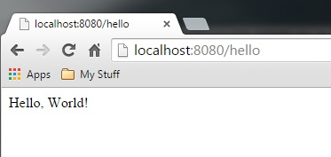
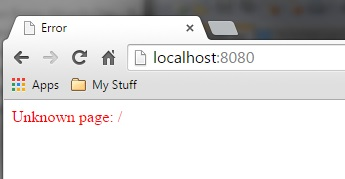
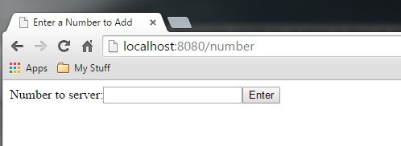

# Final Project Assignment 2: Explore One More! (FP2) 
DUE March 30, 2015 Monday (2015-03-30)

### My Library: xml, net/url
Brian Carlson

For this exploration, I took a look at and explored some tutorial code that used TCP connections to create an HTTP server. The server uses the xml library to convert expressions for the HTTP to send in its header. The net/url Library converts string to URLs, HTML and Paths.

First the server listens for a connection on the defined port. For this example I am just using `8080`. It will accept up to 5 connections and will loop handing off the connections to a accept/handle thread. This tutorial also made use of `custodians` which are very neat things. They handle the proper shut down and clean up of the TCP sockets and Threads created. This example uses a main custodian to make sure all of the sub-custodians shut down properly. The watcher thread will timeout if no request is made after a connection is made.

```

(define (serve port-no)
  (define main-cust (make-custodian))
  (parameterize ([current-custodian main-cust])
    (define listener (tcp-listen port-no 5 #t))
    (define (loop)
      (accept-and-handle listener)
      (loop))
    (thread loop))
  (lambda ()
    (custodian-shutdown-all main-cust)))

(define (accept-and-handle listener)
  (define cust (make-custodian))
  (custodian-limit-memory cust (* 50 1024 1024))
  (parameterize ([current-custodian cust])
    (define-values (in out) (tcp-accept listener))
    (thread (lambda ()
              (handle in out)
              (close-input-port in)
              (close-output-port out))))
  ; Watcher thread:
  (thread (lambda ()
            (sleep 30)
            (custodian-shutdown-all cust))))

```

The server can be started by entering the command `(serve 8080)`. The `handle` function will handle incoming requests made and parse the HTTP header sent, and send a reply.

```
(define (handle in out)
  (define req
    (regexp-match #rx"^GET (.+) HTTP/[0-9]+\\.[0-9]+"
                  (read-line in)))
  (when req
    (regexp-match #rx"(\r\n|^)\r\n" in)
    (let ([xexpr (dispatch (list-ref req 1))])
      (display "HTTP/1.0 200 Okay\r\n" out)
      (display "Server: k\r\nContent-Type: text/html\r\n\r\n" out)
      (display (xexpr->string xexpr) out))))

```

`dispatch` will handle creating new pages/information/etc by using a handler in a table we will create later that holds all possible replys and functions.

```
define (dispatch str-path)
  ;; Parse the request as a URL:
  (define url (string->url str-path))
  ;; Extract the path part:
  (define path (map path/param-path (url-path url)))
  ;; Find a handler based on the path's first element:
  (define h (hash-ref dispatch-table (car path) #f))
  (if h
      ;; Call a handler:
      (h (url-query url))
      ;; No handler found:
      `(html (head (title "Error"))
             (body
              (font ((color "red"))
                    "Unknown page: "
                    ,str-path)))))
                    
(define dispatch-table (make-hash))
```

Now, we can call the dispatcher to make a new page like so:

```

(hash-set! dispatch-table "hello"
           (lambda (query)
             `(html (body "Hello, World!"))))
             
```

Now when `localhost:8080/hello` is accessed, this will display this:



If we try to access a page that doesn't exist we get this:



Using a helper function, we can make an easy for for creating our own HTML form page on the server:

```

(define (build-request-page label next-url hidden)
  `(html
    (head (title "Enter a Number to Add"))
    (body ([bgcolor "white"])
          (form ([action ,next-url] [method "get"])
                ,label
                (input ([type "text"] [name "number"]
                        [value ""]))
                (input ([type "hidden"] [name "hidden"]
                        [value ,hidden]))
                (input ([type "submit"] [name "enter"]
                        [value "Enter"]))))))
                        
```

This can be called like this in racket: 

```

(define (number query)
  (build-request-page "Number to server:" "/reply" ""))
  
  (hash-set! dispatch-table "number" number)
  
```

The page will let you enter a number and then direct you to the `/reply` page. Now when we visit `localhost:8080/number`, we see the following:



Where we can enter a number to the server and then the server could do something with it. I quite suprised by the ease of setting up an HTTP server in racket (some things, like `custodian` and methods of `threads` in Racket were new/confusing at first), and the nice functionality of net/url to translate strings into HTML. This could definitely be useful for the project, maybe doing some network communications or something of the like.
